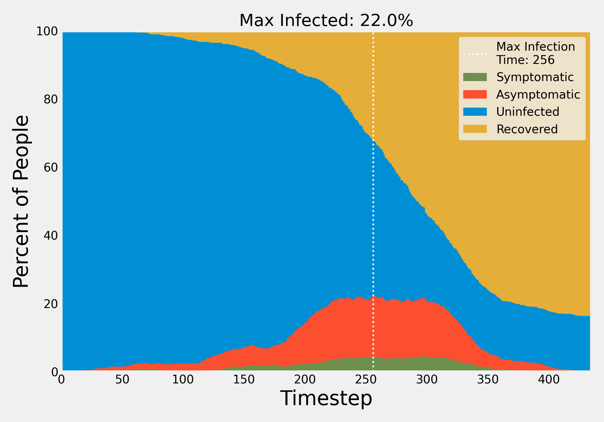

# social-distancing-graph-sim
Simulation for modeling social distancing using a graph-based structure of interaction.

## Motivation
The reason for this simulation is to see how by limiting the number of people with whom we closely interact we can slow down the spread of Covid-19.

Namely, this manifests itself as the parameter `cluster_size` in this simulation. The `cluster_size` represents the size of groups of people who are closely interacting on a day-to-day (ie, not being affected by social distancing). For example, if you live with four other people then your cluster size would be five.

While it is inevitable that you will likely interact with some people distantly (ie at the grocery store), by limiting the number of people with whom you interact intimately it is possible to slow the infection.

Some examples of changing `cluster_size` and its impact on infection can be seen in [Output](#output) below.

## Usage
`python tester.py`

Within that script there are configurable parameters for modeling.

There are a variety of parameters that can be tuned. They are broken into three categories:
 - Graph Construction Parameters:
   - Things like interaction probability with nodes in and out of a given cluster.
   - Size of cluster and number of edges outside of a cluster.
 - Pathogen Parameters:
   - Things like R_0, time to recovery, and the probability of being symptomatic.
 - Simulation Parameters:
   - Things like number of nodes initially infected.


### Dependencies
```
numpy
pandas
networkx
matplotlib
```
### Notes
Only tested in Python3


## Output
The graph constructor aims to simulate some closely interacting clusters that weakly interact with other clusters.

The graph can be visualized as such, where red nodes denote an infection (below the average cluster size was specified to be five):


### Cluster size tuning
By tuning the cluster_size we can see how the resultant timelines of infection are very different.

When clusters are of size __eight__ on average this is the result:


Where at max approximately __65%__ of population is infected.


However, if we reduce the average cluster size to __five__, then we get this.


Where at the max only about __40%__ of the population is infected.

Now that's what I call flattening the curve.
