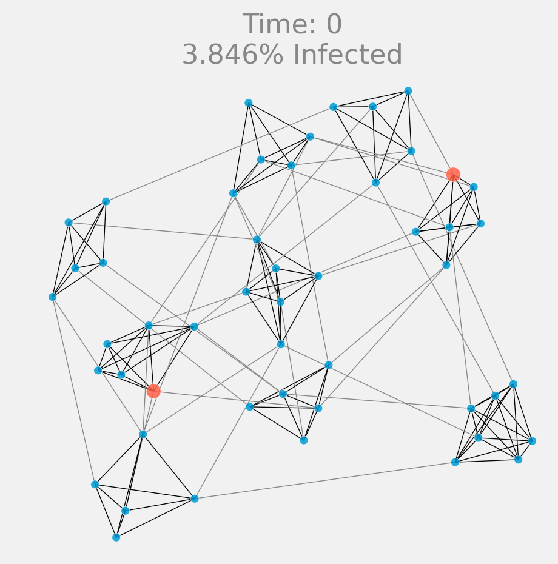

# social-distancing-graph-sim
Simulation for modeling social distancing using a graph-based structure of interaction.

## Usage
`python tester.py`

Within that script there are configurable parameters for modeling.

The parameters that really need tuning to be the most biologically plausible are:
 - `in_cluster_transition`
 - `out_cluster_transtion`
 - `timesteps_for_recovery`

Because they effectively are the infectiousness of the disease.

### Dependencies
```
numpy
pandas
networkx
```
### Notes
Only tested in Python3


## Output
After the simulation you can draw something like this that shows the infection status of all the nodes in the network:



### Cluster size tuning
By tuning the cluster_size we can see how the resultant timelines of infection are very different.

When clusters are of size eight on average this is the result:


Where at max 50% of population is infected.


However, if we reduce the average cluster size to four, then we get this.


Where at the max only about 15% of the population is infected.

Now that's what I call flattening the curve.

## To do:
 - Move infection probabilities out of the graph constructor and
   instead into the simulation object (or a virus object). Maybe? or is this dumb?
